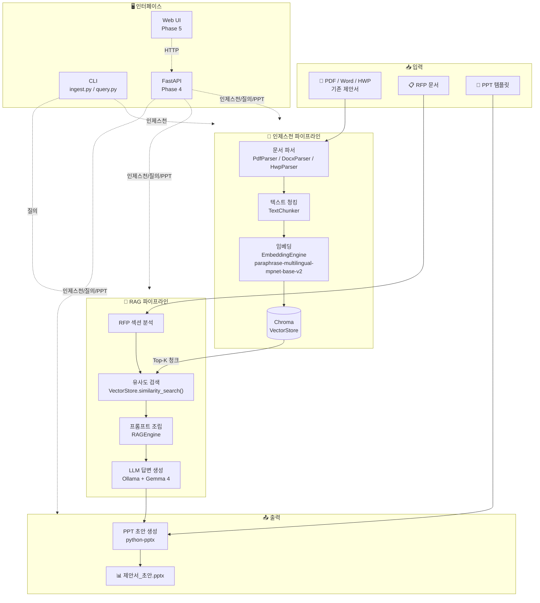
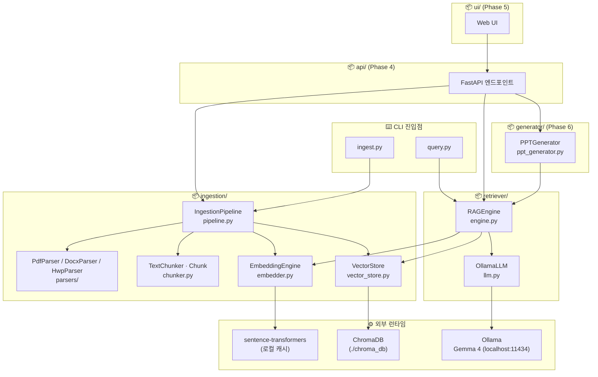
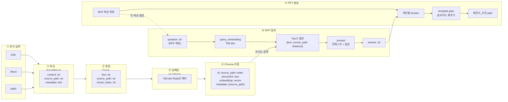

# ragSystem 아키텍처

## 1. 전체 파이프라인 흐름

```mermaid
flowchart TD
    subgraph INPUT["📥 입력"]
        A["📄 PDF / Word / HWP\n기존 제안서"]
        B["📋 RFP 문서"]
        C["🎨 PPT 템플릿"]
    end

    subgraph INGEST["🔄 인제스천 파이프라인"]
        D["문서 파서\nPdfParser / DocxParser / HwpParser"]
        E["텍스트 청킹\nTextChunker"]
        F["임베딩\nEmbeddingEngine\nparaphrase-multilingual-mpnet-base-v2"]
        G[("Chroma\nVectorStore")]
    end

    subgraph RAG["🤖 RAG 파이프라인"]
        H["RFP 섹션 분석"]
        I["유사도 검색\nVectorStore.similarity_search()"]
        J["프롬프트 조립\nRAGEngine"]
        K["LLM 답변 생성\nOllama + Gemma 4"]
    end

    subgraph OUTPUT["📤 출력"]
        L["PPT 초안 생성\npython-pptx"]
        M["📊 제안서_초안.pptx"]
    end

    subgraph INTERFACE["🖥️ 인터페이스"]
        N["CLI\ningest.py / query.py"]
        O["FastAPI\nPhase 4"]
        P["Web UI\nPhase 5"]
    end

    A --> D --> E --> F --> G
    B --> H --> I
    G -->|"Top-K 청크"| I --> J
    J --> K --> L
    C --> L --> M

    N -. "인제스천" .-> INGEST
    N -. "질의" .-> RAG
    O -. "인제스천/질의/PPT" .-> INGEST & RAG & OUTPUT
    P -. "HTTP" .-> O
```

---

## 2. 컴포넌트 구조 (모듈 의존관계)

```mermaid
graph TD
    subgraph CLI["⌨️ CLI 진입점"]
        ingest["ingest.py"]
        query["query.py"]
    end

    subgraph ingestion["📦 ingestion/"]
        pipeline["IngestionPipeline\npipeline.py"]
        parsers["PdfParser / DocxParser / HwpParser\nparsers/"]
        chunker["TextChunker · Chunk\nchunker.py"]
        embedder["EmbeddingEngine\nembedder.py"]
        vectorstore["VectorStore\nvector_store.py"]
    end

    subgraph retriever["📦 retriever/"]
        llm["OllamaLLM\nllm.py"]
        engine["RAGEngine\nengine.py"]
    end

    subgraph generator["📦 generator/ (Phase 6)"]
        ppt["PPTGenerator\nppt_generator.py"]
    end

    subgraph api["📦 api/ (Phase 4)"]
        fastapi["FastAPI 엔드포인트"]
    end

    subgraph ui["📦 ui/ (Phase 5)"]
        webui["Web UI"]
    end

    subgraph external["⚙️ 외부 런타임"]
        ollama["Ollama\nGemma 4 (localhost:11434)"]
        chroma["ChromaDB\n(./chroma_db)"]
        stmodel["sentence-transformers\n(로컬 캐시)"]
    end

    ingest --> pipeline
    pipeline --> parsers & chunker & embedder & vectorstore

    query --> engine
    engine --> embedder & vectorstore & llm
    llm --> ollama
    embedder --> stmodel
    vectorstore --> chroma

    ppt --> engine

    fastapi --> pipeline & engine & ppt
    webui --> fastapi
```

---

## 3. 데이터 흐름

```mermaid
flowchart LR
    subgraph A["① 문서 입력"]
        direction TB
        a1["PDF"]
        a2["Word"]
        a3["HWP"]
    end

    subgraph B["② 파싱\nParseResult"]
        direction TB
        b1["content: str\nsource_path: str\nmetadata: dict"]
    end

    subgraph C["③ 청킹\nChunk"]
        direction TB
        c1["text: str\nsource_path: str\nchunk_index: int"]
    end

    subgraph D["④ 임베딩\nnp.ndarray"]
        direction TB
        d1["768-dim float32 벡터"]
    end

    subgraph E["⑤ Chroma 저장"]
        direction TB
        e1["id: source_path::index\ndocument: text\nembedding: vector\nmetadata: {source_path}"]
    end

    subgraph F["⑥ RFP 질의"]
        direction TB
        f1["question: str\n(RFP 섹션)"]
        f2["query_embedding\n768-dim"]
        f3["Top-K 결과\n{text, source_path, distance}"]
        f4["prompt\n컨텍스트 + 질문"]
        f5["answer: str"]
        f1 --> f2 --> f3 --> f4 --> f5
    end

    subgraph G["⑦ PPT 생성"]
        direction TB
        g1["RFP 섹션 목록"]
        g2["섹션별 answer"]
        g3["template.pptx\n슬라이드 채우기"]
        g4["제안서_초안.pptx"]
        g1 --> g2 --> g3 --> g4
    end

    a1 & a2 & a3 --> B --> C --> D --> E
    E -->|"유사도 검색"| f3
    f5 --> g2
    g1 -.->|"각 섹션 질의"| f1
```
